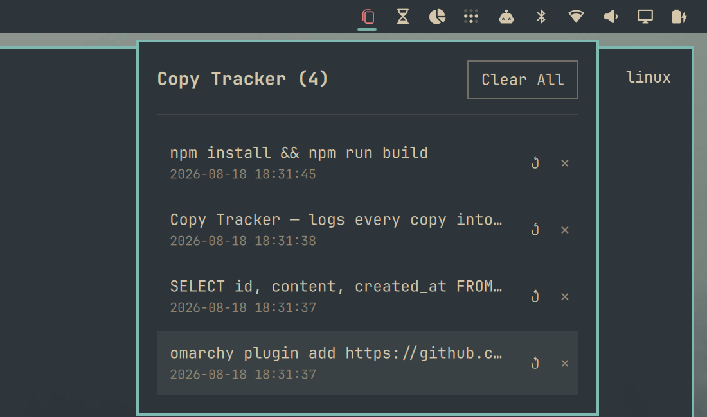

# Copy Tracker

A clipboard history plugin for the [Omarchy](https://omarchy.org/) shell bar. Every copy
action — text or image — is logged as a row in a local SQLite database as it happens. Click
the bar icon to browse the history, re-copy any past entry back to the clipboard, or delete
entries you don't need.




## Install

**Option 1 — `omarchy plugin add` (recommended):**

```bash
omarchy plugin add https://github.com/Macs9319/CopyTracker.git --enable
```

You'll be prompted to pick a bar section (left/center/right) for the icon.

**Option 2 — manual clone:**

```bash
git clone https://github.com/Macs9319/CopyTracker.git ~/.config/omarchy/plugins/copytracker
omarchy plugin enable copytracker right
```

Either way, the shell picks up the plugin without a restart — edits under
`~/.config/omarchy/plugins/` hot-reload automatically. New plugins sometimes need a full
shell restart (not just a hot reload) to size the bar icon correctly the first time:

```bash
omarchy restart shell
```

## Usage

Click the bar icon to open the history panel:

| Action | Effect |
|---|---|
| Type in the search box | Filter entries whose content contains the text |
| Click an entry's ↺ | Copy that entry back to the clipboard and close the panel |
| Click an entry's ✕ | Delete that entry |
| Clear All | Delete the entire history (with a confirmation) |

Text and images are both tracked. Copies flagged as sensitive (e.g. from a password manager)
are skipped, and a copy that repeats the immediately-preceding entry isn't logged twice.

## Requirements

- [Omarchy](https://omarchy.org/) (Quickshell-based shell)
- `sqlite3`, `wl-clipboard` (`wl-copy`/`wl-paste`), and `jq` on `PATH` (all ship by default on
  Omarchy)

## Storage

- Database: `~/.local/state/omarchy/copytracker.db` (table `clips`: `id`, `type`, `content`,
  `mime`, `created_at`)
- Images: saved by content hash under `~/.local/state/omarchy/copytracker-images/`; the
  database row stores the file path
- History is capped at the most recent 1000 entries

## Uninstall

```bash
omarchy plugin remove copytracker
```

Delete `~/.local/state/omarchy/copytracker.db` and `~/.local/state/omarchy/copytracker-images/`
if you also want to wipe the stored history.

## How it works

`Panel.qml` is a single Omarchy shell plugin (`bar-widget` kind) built on the shell's `Panel`
base component. Two background `wl-paste --watch` processes (one for text, one for images)
call `track.sh`, which owns the SQLite schema and every read/write query. The panel shells out
to `track.sh list` (optionally with a search query, debounced as you type) to populate the
popup and to `track.sh copy`/`delete`/`clear` for actions —
no QML-side clipboard or database logic beyond that.

## License

MIT — see [LICENSE](LICENSE).
